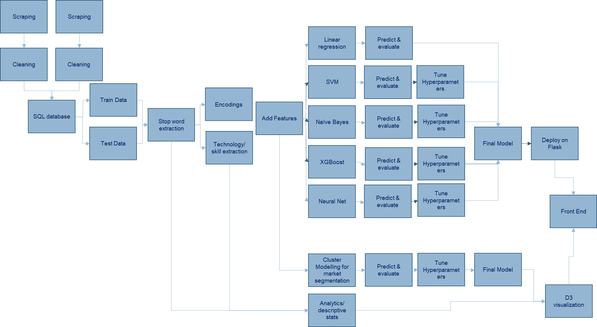

# DataScienceJobs
DSR Project (by Rachel and Janina).

The project's objective is to build an application that will predict the salary range of advertised jobs for data professionals, based on the text of the job description. Use cases are for hiring managers looking to understand the appropriate salary ranges when searching for candidates and job candidates looking to understand what their job description might be worth in the market.

We also plan to segement the market for data professionals to establish whether job titles for data professionals actually describe roles with similar skill sets.

## Workflow

#### 1. Web Scraping
We scraped job descriptions from the several websites (harnham (.co.uk, .de, .com), indeed (.co.uk, .de, .com), monster 
(.co.uk)). The python files to run the scrapings are in the folder 'Web_Scraping'. We scraped the job descriptions for 
different search terms (e.g. data scientist, machine learning, data, business intelligence, data engineer, data manager,
econometrics, statistics, data analyst).

#### The following columns were scraped:
* __job title:__ title of the job (e.g. Data Scientist, Machine Learning Expert, ...)
* __company:__ name of the company
* __job description:__ text describing the position
* __location:__ city, region or country, where job is located 
* __salary:__ salary range 
* __education:__ required education (e.g. Masters, Bachler, PhD, ...)
* __industry:__ industry where job is associated to 
* __career:__ career type of job (e.g. Experienced, Entry level, ....)
* __url:__ url of the job posting
* __extraction date:__ date when job was scraped
* __duration:__ for how long has the job been published
* __jobtype:__ type of job (e.g. permanent, temporary, ...)
* __ref_code:__ unique code for job description (given by website)

#### 2. Cleaning

Data were then cleaned to create a consistent dataset. Further columns were added to allow for identification of country, 
limits and averages of salary ranges and conversion into common currencies. Python files for cleaning can be found in the folder 'Cleaning'

* __job_title:__
* __ref_code:__
* __company:__
* __description:__
* __salary:__
* __salary_low:__ (numeric) bottom of stated salary range
* __salary_high:__ (numeric) top of stated salary range
* __currency:__ currency (symbol) of stated salary
* __salary_average:__ mid point of salary range
* __salary_low_euros:__ (numeric) bottom of stated salary range in euros using October 2019 exchange rate averages (1.14 EUR/GBP, 0.9 EUR/USD)
* __salary_high_euros:__(numeric) top of stated salary range in euros
* __salary_average_euros:__ (numeric) mid point of stated salary range in euros
* __salary_type:__ whether yearly, monthly, daily, hourly
* __location:__ 
* __jobtype:__
* __posted_date:__ calculated date when job was posted (where available)
* __extraction_date:__
* __country:__ Country location of job 
* __region:__ UK region, US State or German state where job is located
* __url:__


#### 3. Postgres Database

Once the initial clean has taken place the data are pushed to a PostgresSQL database in AWS.

The dataframe is first pushed to a landing table, by using the db_upload function from ```SQL/db_upload.py```.

This data is this checked by running:

```SQL/db_upload_checks.py```

If all tests are passed, then the push to database script is run, which pushes all data from the landing table into the all_data table, deletes any rows which are duplicates, and allocates an id and a train/test label.

```SQL/db_push_to_main.py ```


#### 4. Encoding data and selecting columns to model with

Data are taken from the database, split into train, test, validation and Job descriptions are encoded (One Hot encoding, TFIDF, Bag of Words, Word2Vec), by running:
``` model_encodings_rl.py```

files are outputted locally to the data folder.

To choose the variables used in modelling, run:

``` data selection```

#### model training

Run ```XGBoost.py``` for the XGboost predictions on the train and validations sets.


#### A1. Project Plan (Diagram)


