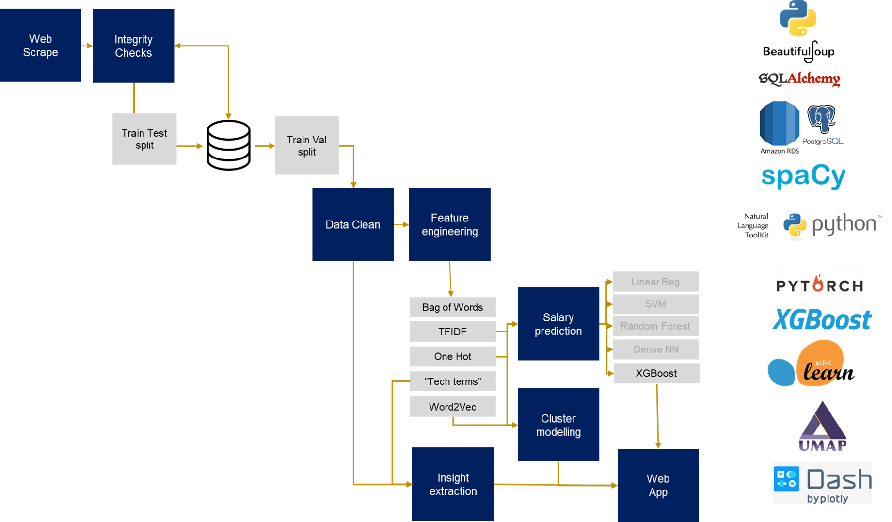

# DataScienceJobs
DSR Project (by Rachel and Janina).

The project's objective is to build an application that will predict the salary range of advertised jobs for data professionals, based on the text of the job description. Use cases are for hiring managers looking to understand the appropriate salary ranges when searching for candidates and job candidates looking to understand what their job description might be worth in the market.

We also plan to segement the market for data professionals to establish whether job titles for data professionals actually describe roles with similar skill sets.

## Results

The results of this project can be found here:

www.motheslund.de

Explanatory Slides can be found [here](https://slides.com/janinamo/from-job-description-to-salary-prediction#/).

## Workflow

#### Project Plan (Diagram)
The diagram depicts the workflow:



#### 1. Web Scraping and Cleaning
We scraped job descriptions from the several websites (harnham (.co.uk, .de, .com), indeed (.co.uk, .de, .com), monster 
(.co.uk)). The python files to run the scrapings are in the folder 'Web_Scraping'. We scraped the job descriptions for 
different search terms (e.g. data scientist, machine learning, data, business intelligence, data engineer, data manager,
econometrics, statistics, data analyst).

#### The following columns were scraped or created:
* __job_title:__ title of the job (e.g. Data Scientist, Machine Learning Expert, ...)
* __description:__ text describing the position
* __country:__ Country location of job 
* __region:__ UK region, US State or German state where job is located
* __salary_average_euros:__ (numeric) mid point of stated salary range in euros
* __salary_type:__ whether yearly, monthly, daily, hourly
* __language:__ language of job description (en, de, ...)

#### 2. Load data to Postgres Database

Once the initial clean has taken place the data are pushed to a PostgresSQL database in AWS.

The dataframe is first pushed to a landing table, by using the db_upload function from ```SQL/db_upload.py```.

This data is this checked by running:

```SQL/db_upload_checks.py```

If all tests are passed, then the push to database script is run, which pushes all data from the landing table into the all_data table, deletes any rows which are duplicates, and allocates an id and a train/test label.

```SQL/db_push_to_main.py ```

Please send us a message if you want to have access to the data.

#### 3. Encoding data and selecting columns to model with

Data are taken from the database, split into train, test, validation and Job descriptions are encoded (One Hot encoding, TFIDF, Bag of Words, Word2Vec), by running:
``` model_encodings_fulltrain.py```

files are outputted locally to the data folder.

To choose the variables used in modelling, run:

``` data selection_fulltrain.py```

#### 4. Model training

Run ```XGBoost.py``` for the XGBoost predictions on the train and validations sets.

There were additional models run (Linear Regression, Random Forest, Neural Net, SVM), which were not used for the final prediction. If you want to have a closer look on the results of the other models open:
```ModelComparison.ipynb```

This Notebook also contains the Shap-Diagram of the XGBoost.


#### 5. App

The visualizations for the app are pre-calulcated and created in the ````preprocessing_dash.py```` in the Visualization folder (you need access to the postgres database).
To run the app, you need to run:

````visualization_dash.py````

The following Pickle-Files are required: 

* xgb_model_all.pkl (created by xgboost.py)
* TFIDF_model_all.pkl (created by model_encodings_fulltrain.py)
* OHE_model_all.pkl (created by model_encodings_fulltrain.py)
* OHE_all.pkl (created by data_selection_fulltrain.py)
* TFIDF_all.pkl (created by data_selection_fulltrain.py)
* word2vec_4.pkl (created by Word2Vec_create.py)
* umap_words.pkl (created by preprocessing.py)
* umap_encoder.pkl (created by preprocessing_dash.py)
* umap_jobs.pkl (created by preprocessing_dash.py)
* plots_density.pkl (created by preprocessing_dash.py)
* bar_cluster.pkl (created by preprocessing_dash.py)
* bar_salary.pkl (created by preprocessing_dash.py)
